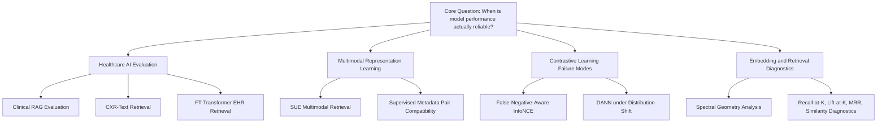

# 🧠 Research Portfolio
## Healthcare AI Evaluation • Multimodal Learning • Retrieval • Model Diagnostics

**Mahrufa Binta Ali**  
Prospective PhD applicant in Computer Science

[Main GitHub Profile](https://github.com/mahrufa-binta-ali) • [Research Portfolio](https://github.com/mahrufa-binta-ali/research-portfolio-ai-retrieval-evaluation)

---

## Research Direction

My current work is organized around one question:

> **When does a strong quantitative result actually indicate that an AI system has learned something reliable?**

I am especially interested in healthcare AI, multimodal representation learning, contrastive learning, retrieval systems, and rigorous model evaluation. Across my projects, I try to separate **optimization success** from **meaningful evaluation** by examining retrieval behavior, supervision quality, semantic false negatives, distribution shift, embedding geometry, and evidence traceability.

Rather than treating a low loss or a single benchmark score as sufficient evidence, I use controlled experiments to ask **why a model succeeds, where it fails, and whether the metric being reported actually measures the intended capability**.

---

## Research Map

---

## Portfolio at a Glance

| Research theme | Project | Main question | Core methods | Evaluation / evidence |
|---|---|---|---|---|
| 🏥 Evidence-first healthcare AI | [**Clinical RAG Evaluation Framework**](https://github.com/mahrufa-binta-ali/clinical-rag-evaluation-framework) | Can a clinical RAG pipeline retrieve traceable evidence before answer generation? | Sentence embeddings, token-aware chunking, ChromaDB, cross-encoder reranking | Source Recall@K, MRR, keyword hit rate, Evidence Phrase Recall@K, embedding-model comparison |
| 🩻 Multimodal healthcare retrieval | [**CXR-Text Bridge Retrieval**](https://github.com/mahrufa-binta-ali/cxr-text-bridge-retrieval) | When does image-text contrastive alignment form, weaken, or collapse? | Dual encoders, L2-normalized embeddings, symmetric InfoNCE | Recall@K, Lift@K, positive-pair similarity, easy/shifted/noisy conditions |
| ⚡ Contrastive-learning failure modes | [**False-Negative-Aware Contrastive Learning**](https://github.com/mahrufa-binta-ali/fn-aware-contrastive-learning) | How do semantic false negatives change retrieval behavior? | Standard InfoNCE vs weighted FN-aware InfoNCE | Recall@K, Lift@K, positive/same-cluster/different-cluster similarity |
| 🧠 Representation diagnostics | [**Spectral Geometry Embedding Analysis**](https://github.com/mahrufa-binta-ali/spectral-geometry-embedding-analysis) | Can embedding geometry reveal failures hidden by aggregate metrics? | Spectral analysis, graph structure, clustering and neighborhood diagnostics | Neighborhood preservation, geometry metrics, collapse/failure analysis |
| 🧬 Tabular / EHR representation learning | [**FT-Transformer EHR Retrieval**](https://github.com/mahrufa-binta-ali/ft-transformer-ehr-retrieval) | Does a transformer-style tabular encoder improve retrieval alignment? | FT-Transformer-style encoder, MLP baseline, controlled synthetic EHR setup | Recall@K, Lift@K, sample-size and architecture comparisons |
| 🔄 Robustness under shift | [**Domain Adaptation DANN Retrieval**](https://github.com/mahrufa-binta-ali/domain-adaptation-dann-retrieval) | Can domain-adversarial learning preserve useful retrieval structure under distribution shift? | DANN, domain-adversarial objectives, representation alignment | Source/target retrieval behavior, shift diagnostics |
| 🔗 Weakly paired multimodal learning | [**SUE Multimodal Retrieval**](https://github.com/mahrufa-binta-ali/sue-multimodal-retrieval) | How can multimodal alignment be studied when exact pairing is scarce? | Spectral geometry, sparse anchors, InfoNCE, MMD | Retrieval quality and alignment diagnostics under weak pairing |
| 🧩 Pair-construction quality | [**Supervised Metadata Pair Compatibility**](https://github.com/mahrufa-binta-ali/propensity-matching-multimodal-pairs) | How strongly does training-pair quality control downstream retrieval? | Metadata similarity, supervised logistic pair-compatibility scoring | Exact-pair precision, same-group precision, Recall@K, Lift@K |

> **Methodological note:** the repository named `propensity-matching-multimodal-pairs` now documents its method as **supervised metadata pair compatibility**. The current implementation uses known pair labels to train a compatibility classifier and is not presented as classical causal propensity-score matching.

---

## Featured Research Projects

### 🏥 1. Clinical RAG Evaluation Framework

This project evaluates the **retrieval layer of clinical RAG before generation**. The goal is to make evidence inspectable and traceable rather than treating an LLM answer as the first evaluation target.

| Component | Implementation |
|---|---|
| Document processing | PDF ingestion + token-aware overlapping chunking |
| Embeddings | Sentence-transformer models; comparative evaluation across multiple encoders |
| Retrieval | ChromaDB vector search |
| Optional reranking | Cross-encoder reranking |
| Evaluation | Source Recall@K, MRR, keyword hit rate, Evidence Phrase Recall@K |
| Engineering | FastAPI, Docker, tests, Hugging Face Spaces deployment |

**Research lesson:** source-level retrieval can look perfect while evidence-level retrieval still differs substantially across embedding models. This motivates evaluating whether retrieved chunks actually contain useful supporting evidence, not only whether the correct source document appears.

**Boundary:** the current system intentionally stops at retrieval and does not claim to evaluate generated clinical answers or provide clinical decision support.

➡️ [Open repository](https://github.com/mahrufa-binta-ali/clinical-rag-evaluation-framework)

---

### 🩻 2. CXR-Text Bridge Retrieval

A controlled study of whether CXR-like images and report-style embeddings can form a useful shared retrieval space.

| Experimental factor | What is tested |
|---|---|
| Data difficulty | Easy, shifted, noisy alignment conditions |
| Scale | 10k and 30k controlled datasets |
| Architecture | Compact image encoder + text projection branch |
| Objective | Symmetric InfoNCE in an L2-normalized shared space |
| Retrieval evaluation | Recall@1/10/50, Lift@K, positive-pair similarity |
| Compute analysis | Batch size, epoch time, peak CUDA memory |

The project is designed to study the gap between **optimization** and **retrieval usefulness**: lower contrastive loss or higher pair similarity does not automatically guarantee strong ranking among many candidates.

**Boundary:** the benchmark uses synthetic CXR-like images and report-style embeddings. It is an alignment-behavior and pipeline-validation study, not a clinical-performance claim.

➡️ [Open repository](https://github.com/mahrufa-binta-ali/cxr-text-bridge-retrieval)

---

### ⚡ 3. False-Negative-Aware Contrastive Learning

This project studies what happens when samples that are semantically related are treated as negatives by standard contrastive learning.

The benchmark compares standard symmetric InfoNCE with a variant that **downweights same-cluster non-paired negatives**. It varies dataset condition, sample size, and downweighting strength.

A central result is intentionally non-universal: the FN-aware objective helps some retrieval metrics in specific clustered settings, but it does **not** consistently beat standard InfoNCE across all conditions. Clean data already performs strongly, while corrupted positive supervision remains difficult for both objectives.

That negative/mixed result is part of the point: **a proposed loss modification should be evaluated conditionally, not assumed to improve representation quality everywhere.**

➡️ [Open repository](https://github.com/mahrufa-binta-ali/fn-aware-contrastive-learning)

---

## Evaluation Philosophy

These projects are connected by a common evaluation philosophy:

| Question | Why it matters | Example project |
|---|---|---|
| **Does optimization imply useful retrieval?** | Training loss can improve while ranking remains weak. | CXR-Text Bridge Retrieval |
| **Are the positive pairs trustworthy?** | A good encoder cannot fully compensate for poor supervision. | Supervised Metadata Pair Compatibility |
| **Are some negatives actually semantically related?** | Standard contrastive assumptions can distort representation structure. | FN-Aware Contrastive Learning |
| **Does the metric measure the intended capability?** | Source-level success may hide evidence-level failure. | Clinical RAG Evaluation Framework |
| **What happens under shift?** | In-distribution performance does not prove robustness. | DANN Retrieval |
| **What does the embedding space actually look like?** | Aggregate metrics can hide collapse, fragmentation, or distorted neighborhoods. | Spectral Geometry Embedding Analysis |

---

## Technical Toolkit

<table>
<tr>
<td width="25%" valign="top">

### 💻 Programming
- Python
- C/C++
- SQL
- JavaScript / TypeScript

</td>
<td width="25%" valign="top">

### 🧠 ML / Modeling
- PyTorch
- Scikit-learn
- Dual encoders
- Contrastive learning
- Tabular transformers
- Domain adaptation

</td>
<td width="25%" valign="top">

### 📊 Evaluation
- Recall@K
- Lift@K
- MRR
- Similarity diagnostics
- Neighborhood analysis
- Evidence-level retrieval metrics

</td>
<td width="25%" valign="top">

### 🛠️ Engineering
- NumPy / Pandas
- Git / GitHub
- FastAPI
- Docker
- Hugging Face Spaces
- Reproducible experiment workflows

</td>
</tr>
</table>

---

## Research Workflow

Across projects, I try to follow the same sequence:

1. **Formulate a narrow research question.**
2. **Build a controlled setup** where the source of failure can be isolated.
3. **Establish interpretable baselines** rather than evaluating one method in isolation.
4. **Separate optimization objectives from evaluation metrics.**
5. **Inspect failure cases and representation behavior**, not only the best score.
6. **State methodological boundaries explicitly**, especially for synthetic or healthcare-oriented experiments.
7. **Document reproducibility** through scripts, result tables, experiment summaries, and project-level limitations.

---

## Current Limitations I Treat Explicitly

My current portfolio includes several controlled synthetic benchmarks. I use them to isolate method behavior, but I do **not** present them as substitutes for validation on real clinical or real-world data.

Current limitations across projects include:

- limited or single-seed comparisons in some benchmarks
- synthetic data in several controlled studies
- small evaluation corpora in early retrieval prototypes
- limited uncertainty estimation
- no claim of clinical deployment readiness

These limitations define the next stage of the work rather than being hidden from the evaluation.

---

## Next Research Steps

- Evaluate the strongest retrieval ideas on authorized real multimodal or clinical datasets.
- Add repeated seeds, uncertainty estimates, and confidence intervals to controlled benchmarks.
- Study benchmark construct validity: **does a metric measure the clinical or reasoning capability it claims to measure?**
- Connect evidence retrieval with downstream generation evaluation without losing source traceability.
- Expand robustness analysis under distribution shift, noisy supervision, and subgroup variation.
- Compare retrieval metrics with embedding-space and neighborhood diagnostics to identify hidden failure modes.

---

## Additional Research & Applied Projects

| Project | Area | What it demonstrates |
|---|---|---|
| [BioMedVisionLab](https://github.com/mahrufa-binta-ali/BioMedVisionLab) | Biomedical visual evaluation | Retrieval inspection, super-resolution evaluation, contact-map visualization, model comparison workflows |
| [BioTrust-Fusion](https://github.com/mahrufa-binta-ali/BioTrust-Fusion) | Multimodal ecological AI | Geographic, temporal, uncertainty-aware evaluation across ecological and Earth-observation data |
| [Sumora](https://github.com/mahrufa-binta-ali/sumora) | Applied AI / software | End-to-end product development with Next.js, TypeScript, external APIs, and natural-language interaction |

---

## 🔗 Connect

### Building research-oriented AI systems by asking not only **“does it work?”** but **“what exactly does the evaluation prove?”**

